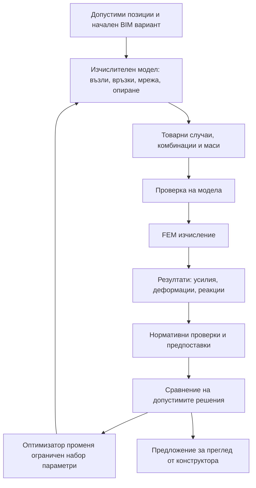

# BIM → FEM → Еврокод → оптимизация

Дата: 2026-10-09. Статус: архитектурен и изпълнителен план; FEM solver още не е интегриран.

## 1. Защо се появи шайба 3.80 m

Текущият генератор удължаваше шайбите в стъпки от 10 cm до вътрешен лимит 4 m, за да достигне предварителния ориентир за площ. Това не беше резултат от изчислени усилия, деформации или необходима армировка. Самата дължина 3.80 m не доказва грешка или правилност на конструкцията; проблемът е липсата на изчислително основание за избора.

Корекция в текущата доставка: видимо поле за максимална дължина на нова шайба; начална настройка 2.50 m или вече избраната начална дължина, ако тя е по-голяма. Това е параметър за генериране, не нормативен максимум. Прегледът показва дебелините и дължините. Недостигащата площ остава видима, вместо ограничението да се прескача. Приетите елементи и продълженията от долен етаж запазват размерите си.

Показаните 6.26 m са подпорен интервал от геометричния оценител. Червените точки измерват близост до опори. Двата показателя не са FEM провисване и не решават въпроса за необходимата дължина на шайбата.

## 2. Предложен цикъл

Solver-ът решава математическия модел. Изграждането на правилния модел, товарните комбинации и нормативните проверки са отделни от него. Успешното числено решение само по себе си не означава нормативно издържана схема.

## 3. Разделяне на модулите

| Модул | Вход | Резултат |
|---|---|---|
| `LayoutCandidateGenerator` | Стени, оси, ядра, отвори, фиксирани елементи, ограничения | Допустими BIM варианти с произход на предложенията |
| `AnalysisModelBuilder` | Неизменяем BIM вариант и явно избрани изчислителни предпоставки | Възли, елементи, координатни системи, мрежа, връзки и опори |
| `LoadCombinationBuilder` | Товарни случаи, категории, маси, приложими нормативни настройки | Версионирани комбинации за ULS, SLS и сеизмика |
| `FemSolverAdapter` | Нормализиран модел и комбинации | Числен статус, реакции, усилия, премествания и диагностични данни |
| `CodeCheckEngine` | FEM резултати, сечения, армировка, материали, нормативен профил | Проверка по елемент/комбинация; недостиг или липсващи данни |
| `LayoutOptimizer` | Допустими параметри и проверени резултати | Следващ кандидат и обяснение на промяната |
| `EngineeringReview` | Кандидати, предпоставки и история на оценките | Избор, заключване на елементи, отхвърляне и Undo |

Текущите `VerticalCapacityCalculator`, `SeismicAnalysisCalculator` и `DeflectionCalculator` могат да служат за предварителен филтър и сравнение. Те не се преименуват на FEM и не се използват като заместител на липсващо изчисление.

## 4. Какво трябва да знае изчислителният модел

- Всички разглеждани етажи и връзките между тях. Самостоятелен план не определя натрупаните товари и пространствената сеизмична схема.
- Долна и горна кота на всеки вертикален елемент. Текущият етажен модел използва плоча при котата на етажа; трябва да се уточни кои колони са под нея и кои над нея. Не се извежда носеща връзка само от общ индекс в списъка.
- Колони и греди като пространствени прътови елементи; плочи и шайби като подходящи плочни/черупкови елементи или изрично валидирана еквивалентна схема.
- Реални отвори в плочите и стените; правилни възли по контури и контакти. Мрежата не премоства отвор с измислен материал.
- Референтни линии, геометрични центрове и ексцентрицитети. Шайба, поставена по лице, не се свързва автоматично по грешна ос.
- Гранични условия и фундаментно опиране. Не се приема запъване, свободна ротация, пружина или корав под без ясно записана предпоставка.
- Материали, етажни височини и ефективни коравини. Напукване, пълзене и дълготрайни деформации изискват отделна методика.
- Еднакви физични единици в целия модел; CAD координатите се нормализират и оригиналните BIM идентификатори се пазят за обратното показване.

## 5. Товари и нормативен профил

В проекта има бетон, етажни височини и част от площните/линейните товари. Няма достатъчно явни входни данни за пълно оразмеряване на произволна сграда. Нужни са категории на товарите, приложими издания и национални приложения, местоположение/сеизмични параметри, почва, конструктивна система, фундаментни предпоставки и армировка или разрешен каталог за нейното търсене.

Трябва да се реализират поетапно:

1. Товарни случаи и приложими комбинации по EC0/EC1.
2. Гравитационни ULS/SLS резултати и проверки по EC2: съчетано действие на нормална сила и моменти, срязване, продънване, деформации и детайлиране в заявения обхват.
3. Сеизмични изчисления и проверки по EC8 с националните настройки: маси, спектър, форми, комбинации, ексцентрицитети, етажни премествания и правилата за избраната система.
4. Фундаментни проверки в отделно заявен обхват; без автоматично твърдение за проверка по EC7 от чертеж на ивични основи.

Без необходимите данни резултатът е „непроверено“, с конкретна причина. Ориентирът за процент шайби остава диагностичен показател и не е цел, която сама може да докаже нормативна достатъчност.

## 6. Числени и диагностични правила

Преди FEM: геометрична валидност, положителни сечения, разумни единици, липса на дублирани възли/елементи, правилни връзки и опори, качествена мрежа и съгласувани товари/маси.

След FEM: проверка за механизъм или сингулярност, състояние на решението, равновесие между реакции и товари, идентификатори на резултатите, чувствителност към мрежата и ясни локални оси/знаци на усилията.

Предлагани състояния на изчислението: `invalidModel`, `unstable`, `nonConverged`, `solverError`, `solved`. Проверка има отделно състояние: `notEvaluated`, `notApplicable`, `withinLimit`, `exceeded`. Числена грешка не се заменя с предварителен доклад, обозначен като преминал FEM.

Всеки резултат съдържа отпечатък на точния модел, версиите на solver-а и проверките, единици, комбинации и предпоставки. Промяна на геометрия, материал, товар или опиране обезсилва стария резултат.

## 7. Как оптимизаторът избира схема

Твърди ограничения: побиране в допустимите стени, запазени отвори, зададен максимум на сеченията/дължините, вертикална съгласуваност, фиксирани ръчни елементи и липса на забранени застъпвания. Архитектурен отвор може да приеме колона само според вече разрешения резервен режим, с ясно обозначение за преглед.

Променливи: допустима позиция по стенната мрежа/осите, сечение от каталог, дължина и дебелина на шайба, добавяне/премахване на автоматична опора. Промяна на плоча или гредова система е отделно разрешен набор, не скрит начин да се подобри оценката.

Ред на избор:

1. Отхвърляне на невалидни или числено неразрешени модели.
2. Отстраняване на нормативните превишения в действително проверения обхват.
3. Намаляване на материалния обем, броя ненужни елементи, разнообразието на сеченията, архитектурните конфликти и сложните вертикални прехвърляния.
4. Сравнение на коравината, усукването и деформациите между допустимите решения.

По-добър брой колони или процент шайби не компенсира непреминала проверка. Първият оптимизатор трябва да е ограничено, обяснимо локално търсене: най-неблагоприятна проверка → малък набор архитектурно допустими промени → преизчисление → запазване на подобрението. Генетични/масови търсения имат смисъл след валидиран модел и измерено време за решаване.

Нужни са лимит на итерациите/времето, спиране от потребителя, кеш по отпечатък на модела и запазване на последния действително оценен кандидат. Една външна команда „Следващ вариант“ остава достатъчна; вътрешните итерации не се представят като отделни проверени варианти, докато не приключат.

## 8. Solver и изпълнение във Flutter

Препоръчана архитектура за първия прототип: solver извън Flutter зад заменяем адаптер; асинхронна задача с отменяне, ограничен ресурс и структуриран обмен на модели/резултати. Първото валидиране е локално на настолен компютър. Работа от телефона към изчислителна услуга е отделно решение; тази доставка не стартира услуга и не изпраща проекти към външен сървър.

OpenSees е технически кандидат за прототип: има прътови и черупкови елементи и спектрални изчисления. Окончателният избор трябва да отчете лиценза и начина на разпространение; не се приема автоматично, че може да се вгради в търговско приложение. По-късно може да се прецени собствен native solver/FFI, но той също изисква независима валидация и поддръжка.

## 9. Етапи и критерии за приключване

| Етап | Доставка | Приемане |
|---|---|---|
| A. Контрол на предложенията | Явни граници, размери и остатъчни проблеми | Генераторът не преминава зададените граници; текущата корекция за шайбите е реализирана |
| B. Изчислителен модел | Формат, builder и валидатор; физични коти/връзки | Малки еталонни модели имат възпроизводими възли, опори, мрежа и товари |
| C. Линеен FEM | Адаптер, гравитационни случаи и резултати | Греда, конзола, рамка, плоча и модел с отвор са сравнени с аналитични/независими резултати; проверени реакции и сгъстяване на мрежата |
| D. Нормативни проверки | Ясно заявен EC2 обхват и липсващи данни | Резултатите са проследими до елемент, комбинация и предпоставка; няма фиктивно „преминало“ |
| E. Оптимизация | Ограничени промени и повторен FEM | Подобрение е потвърдено с преизчисление и запазени твърди ограничения |
| F. Пространствена сеизмика | Многоетажен модел, маси, модален/спектрален анализ и EC8 обхват | Независимо сравнение и инженерна проверка на заявената методика |

Оригиналният BIM модел от снимките трябва да стане регресионен пример. От снимка не може надеждно да се възстановят сечения, дебелини, опиране, височини, армировка и товари.

## 10. Първични технически източници

- [The Concrete Centre — Bending and axial force](https://www.concretecentre.com/Codes/Eurocode-2/Flexure/Bending-and-axial-force.aspx): оразмеряването на колони отчита моменти, несъвършенства и стройност.
- [JRC — Eurocode 8 worked examples](https://eurocodes.jrc.ec.europa.eu/publications/eurocode-8-seismic-design-buildings): примерите включват земна основа, сеизмични въздействия, изчислителни предпоставки и проектиране.
- [OpenSees — ASDShellQ4](https://opensees.github.io/OpenSeesDocumentation/user/manual/model/elements/ASDShellQ4.html): документация на четиривъзлов черупков елемент.
- [OpenSees — responseSpectrumAnalysis](https://opensees.github.io/OpenSeesDocumentation/user/manual/analysis/responseSpectrumAnalysis.html): спектралната команда изисква предходно модално изчисление; комбинирането на модалните резултати е отделна задача.
- [OpenSees — License](https://opensees.github.io/OpenSeesDocumentation/developer/license.html): условия за използване и включване в разпространявани продукти.

Проверки на текущата корекция: 41 теста преминаха; проверени са задаваемият максимум, CAD единиците, запазването на приети/продължени елементи, видимите дължини и мобилното поле за настройка.
