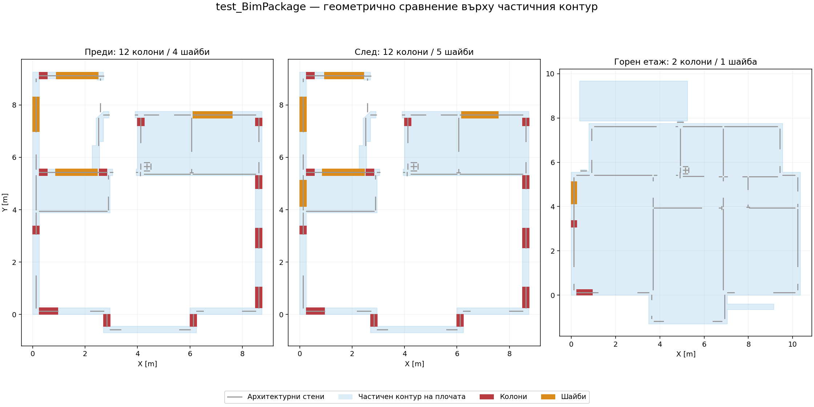

# Автоматично поставяне на колони и шайби — test_BimPackage

Използван е изпратеният `test_BimPackage.zip`, с оригиналната архитектура от двете KCAD подложки, 100 CAD единици на метър и запазеното подравняване между етажите. Оригиналният архив не е променян.

## Корекции

- Разпознаването на стени и прозорци анализира запазената архитектура без генерираните копия в BIM слоевете и блоковете. Изключването използва точните имена в завършените метаданни; потребителски слоеве с BIM в името се запазват. Видимостта се възстановява само в отделен изглед за анализа.
- Адаптивното търсене допуска шайби от 1 m в къси плътни участъци, със същата долна граница като началния генератор. Цялото сечение трябва да е в допустимата архитектура и плочата, без отвори и колизии. При изключени адаптивни размери зададената дължина се запазва.
- След първите два кръга с разпределен бюджет подходящите операции могат да използват останалите оценки, до общия зададен максимум.
- Отместването на колоните от краищата на стените се определя от дълбочината на сечението. Колони, подравнени точно по напречна ос, запазват това подравняване при локалното търсене.
- Същият изглед на оригиналната подложка се използва при възстановяването на стар празен кеш на плочите.

## Измерване върху архива

Старият вход отчита 98 / 116 стенни двойки, включително BIM копията. Новият вход отчита 48 / 57 оригинални двойки на двата етажа.

Сравнението по-долу използва едни и същи три начални варианта и общ оценител върху геометрията на долния етаж. За диагностиката е използван локален геометричен тест без предоставен отвор за стълби. Изискването за такъв отвор в приложението остава включено.

| Показател | Предишно оптимизирано търсене | След корекцията |
|---|---:|---:|
| Колони / шайби | 12 / 4 | 12 / 5 |
| Оценени варианти | 40 | 64 |
| Показател за баланс, по-нисък е по-добър | 0.6034 | 0.4962 |
| Проверки без достатъчно данни | 32 | 31 |
| Най-голям измерен отвор между опори | 2.30 m | 2.30 m |
| Бетон в опорите | 8.022 m³ | 8.582 m³ |
| Нерешена площ на плочата | 23.489 m² | 23.489 m² |
| Установени затворени полета | 0 | 0 |

Допълнителната къса шайба подобрява предварителния баланс срещу увеличение на обема на опорите с 0.56 m³. Геометричното търсене остава ограничено до 64 оценки. Измереното време на този компютър е приблизително 1.35 s за новото търсене; то зависи от машината.

На горния етаж, след реалното подравняване на подложката, генераторът продължава 2 колони и 1 шайба от долния. Другите 14 опори не се вписват в архитектурната геометрия на горния етаж и са отчетени за преглед. Проверена е непрекъснатостта на всички предложени горни опори.

## Оставащи данни за пълна схема

Автоматичният контур на плочата е частичен: показаното синьо покритие включва стените и само затворените пространства. Топологично простият полигон не доказва, че е обхваната цялата плоча. Не е затворено нито едно опорно поле и нерешената площ не намалява при това сравнение. Необходим е уточнен пълен контур и местоположение/размери на отвора за стълбите, преди схемата да се оценява като цяло.

Схемите са диагностични предложения и не са приложени в потребителската BIM библиотека.

## Проверки

Постоянният тест `test/bim_package_support_placement_test.dart` пази геометрията от архива, проверява подобрение спрямо предишния вариант, всички сечения/отвори/колизии, детерминизъм, ограничението от 64 оценки и непрекъснатостта към горния етаж. Проверено е, че липсващият отвор за стълби все още блокира пълното генериране на най-долния етаж.

Преминават 84 теста за генериране, оптимизация, автоматично поставяне, плочи и BIM пакет, плюс сравнителният тест върху замразените синтетични случаи. Анализаторът не отчита проблеми в променените модули.

Пълните показатели са в `bim_package_support_placement_benchmark.json`.
