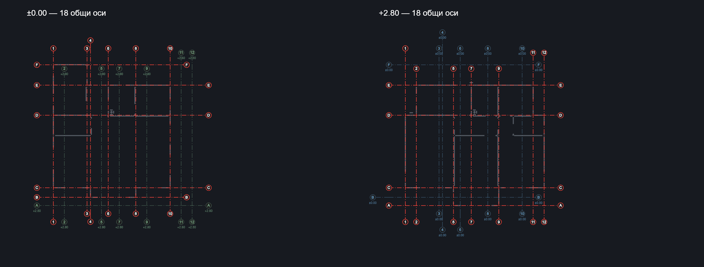

# Обща мрежа от оси за BIM проекта

Всяка физическа ос има едно общо име за всички етажи. Съвпадащите оси се обединяват след подравняването на подложките, а нова ос се добавя в общата геометрична последователност. При вмъкване се коригира номерацията на всички етажи едновременно. Идентификаторът на съществуващата ос се запазва при преномериране.

Осите, установени на текущия етаж, са с нормалния червен цвят. Всички оси запазват съществуващия пунктир с точка. Осите само от други етажи са по-тънки и бледи, с дискретна кота/коти на произхода под обозначението. Цветът се определя от най-ниската кота, която използва съответната ос, и е еднакъв във всички изгледи, където тя е референтна. На избрана ос панелът показва всички коти, на които е установена.

Този подход показва и осите само от по-ниски етажи на горните планове. Така конструкторът може да сравнява цялата обща мрежа, без да приема референтна ос за доказателство за стена или опора на текущия етаж. Старите ръчни оси без информация за произход се запазват като общи проектни оси.

Близките надписи се разместват по продължението на осите, за да не се застъпват. Позицията на самата ос не се премества. Общи оси не се рисуват втори път при включена етажна референция.

## Резултат върху test_BimPackage

Двете подложки съдържат по 11 предложени оси. След обединяване проектът има 18 различни оси, с уникални имена: A–F и 1–12. Четири оси са общи за двата етажа; по седем са установени само на единия.

| Изглед | Ос от текущата кота | Референтни оси | Общо |
|---|---:|---:|---:|
| ±0.00 | 11 | 7 от +2.80 | 18 |
| +2.80 | 11 | 7 от ±0.00 | 18 |

Изображението е диагностично рендериране на действителната обща мрежа върху стенните линии от архива. Използван е същият 2D художник, с Arial за четими надписи вместо квадратния тестов шрифт. Потребителският архив и BIM библиотеката не са променяни за тази проверка.

## Поведение при добавяне и ревизия

- При нови оси на +5.60 те се появяват на долните етажи като референтни, със собствен цвят и кота.
- Проверка за една и съща ос използва подравняване на безкрайните линии и 5 mm геометричен толеранс, а не старото сближаване до 15 cm. Близки различни оси се запазват отделно.
- Автоматичните общи оси обхващат дължините от всички етажи. Ръчните корекции на тяхната геометрия се запазват при ревизии.
- При преместване на източника на един етаж старата обща ос остава за другите етажи, а новото подравняване получава отделна ос.
- Изтрита обща ос остава изтрита, включително след повторна обработка с нови идентификатори на източника.
- DXF файловете съдържат същата обща номерация и отделни бледи слоеве за референтните оси, с коти на произхода. Пунктирът с точка се запазва и в DXF; дебелината е 0.15 mm за текущи и 0.09 mm за референтни оси.

## Проверки

Добавени са 10 проверки за общи оси: три етажа, общо преномериране, разделяне при ревизия, запазване на ръчни корекции, CAD единици и завъртане, няколко направления, DXF, двойно рисуване при етажна референция, удължаване на общи оси и запазване на изтривания след преобработка. Допълнително е проверен реалният архив и стабилността на повторното зареждане.

Преминават 68 теста за общите оси, BIM ревизиите/експорта, автоматичното поставяне и редакцията на плочи/опори. Анализаторът не отчита проблеми в променените модули.

Съществуващите BIM проекти получават общата номерация и информацията за етажите при синхронизирането на подложките, включително когато кешът за плочите не изисква промяна.

След корекцията на графиката повторно преминаха 10-те проверки за общите оси и проверката върху реалния архив (общо 11). Анализаторът не отчита проблеми в художника, DXF експорта и тестовете.
