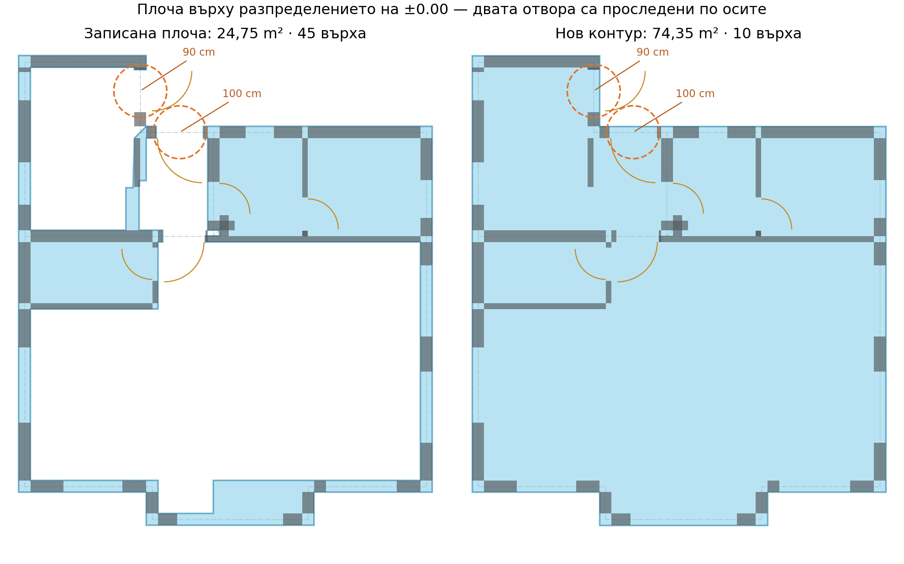

# Контур на плочата при две врати — test_BimPackage(1).zip

На разпределението ±0.00 плочата навлизаше през отворите 90 и 100 cm и обхождаше стените от вътрешната страна. Записаният модел съдържа плоча 24.7539 m² с 45 върха. До двете каси има къси 25 cm стени: единият участък е дълъг 5 cm, другият 9 cm. Старото изискване за минимум 10 cm ги изключваше от свързването през отвора.

Новата проверка строи опорна мрежа от осите на наблюдаваните стени на текущия етаж с номинална дебелина 25 cm (допуск ±20%). При всяко пресичане се проверява дали и двете оси имат действителен стенен участък там. За късите каси се търсят най-близките подкрепени пресичания преди и след отвора. Неподкрепените пресичания не разрешават свързване. Полученото свързване е само между наблюдаваните каси, максимум 1.5 m, при съвпадащи стенни лица; не удължава стена до далечна ос.

Запазени са проверките за пресичаща стена, връщащи се навътре стени при ниша/лоджия, широки отвори и конкуриращи се предложения. Растерният етап продължава да определя свързаността, а крайният контур лежи върху стенните лица. Поправена е и посоката на напречното отместване при съвсем леко разминаване на две съответстващи оси.

За този чертеж резултатът е един прост контур с 10 върха и площ 74.3475 m². Отворите 90 и 100 cm вече не пропускат външната област към вътрешността. Реалният отстъп в горната част остава извън плочата. Това е геометрично предложение за контур; данните за отвора остават отбелязани като хипотези, а не като разпознати типизирани врати.

## Обновяване на съществуващи проекти

Slab envelope v6 и BIM metadata v4 задействат преизчисляване при подготовката на подложките. Генераторът обновява и непразните стари envelope кешове от оригиналната архитектура, в текущите координати, без повторно прилагане на alignment. Версията на алгоритъма участва и в ключа на структурната синхронизация. Ръчните промени по контурите остават защитени; автоматичният контур се обновява само ако съвпада със запазения snapshot.

В изпратения архив плочата действително е редактирана ръчно спрямо автоматичния snapshot (45 вместо 46 върха и променен участък долу). Тя не се заменя автоматично. Подготвен е отделен структурен модел `examples/test_BimPackage_slab_fixed.bim.json`, в който само полигонът на тази плоча е заменен с новия контур. Всички останали полета на модела са запазени. Оригиналният архив и библиотеката на потребителя не са променяни.

## Проверки

Преминаха 106 регресионни теста за контури, проекции, топология, BIM кешове/ревизии/експорт, общи оси, етажна принадлежност и прилепване. Добавената допълнителна проверка за непразен стар кеш също премина (общо 107 различни проверки). Новият тестов модул съдържа 16 проверки: двата реални етажа при три CAD мащаба и две завъртания, празни пресичания, реална ниша с къси каси, напречно отместване и миграция без двойна трансформация.

Отделно е изпълнен целият предоставен архив през зареждане на KCAD, подравняване, генериране от стария непразен кеш и структурна синхронизация. Проверени са обновяването на недокоснат snapshot, запазването на ръчно редактирания модел, повторното зареждане и валидната топология. Анализаторът не отчита проблеми в променените модули.
